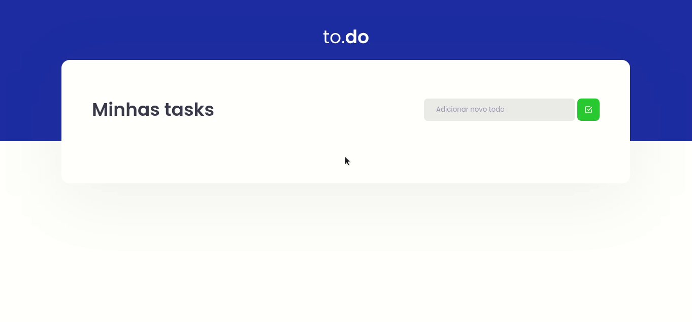

<h1 align="center">
  
</h1>

<p align="center">
  <a href="#-tecnologias">Tecnologias</a>&nbsp;&nbsp;&nbsp;|&nbsp;&nbsp;&nbsp;
  <a href="#-projeto">Projeto</a>
</p>


<br>

<p align="center">
  
</p>

## 🚀 Tecnologias

Tecnologias utilizadas:

- ReactJS
- Typescript
- SASS

## 💻 Projeto

<p>O <strong>to.do</strong> é o primeiro desafio da tilha de React do Rocketseat Ignite, nesse desafio foi proposto a implementação das funcionalidades de uma app de todo simples.</p>

---

#### 🛠️ Instale o projeto na sua máquina:

```bash

    # Clonar o repositório
    $ git clone https://github.com/marcoskloss/to.do-rocketseat-ignite-react

    # Entrar no diretório
    $ cd to.do-rocketseat-ignite-react

    # Instalando as dependencias com Yarn
    $ yarn install
    # Executando a aplicação
    $ yarn dev
    
    # Instalando as dependencias com NPM
    $ npm install
    # Executando a aplicação
    $ npm run dev
```

---
